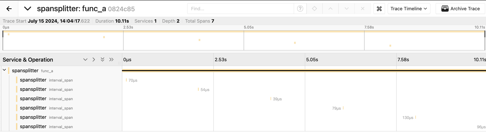

# Run

```bash

# Run the jeager endpoint
docker run -d -p16687:16686 -p4317:4317 -e COLLECTOR_OTLP_ENABLED=true jaegertracing/all-in-one:latest

# Run the app
OTEL_EXPORTER_OTLP_ENDPOINT=http://localhost:4317 OTEL_EXPORTER_OTLP_PROTOCOL=grpc OTEL_SERVICE_NAME=spansplitter cargo run
```

# tracing UI

